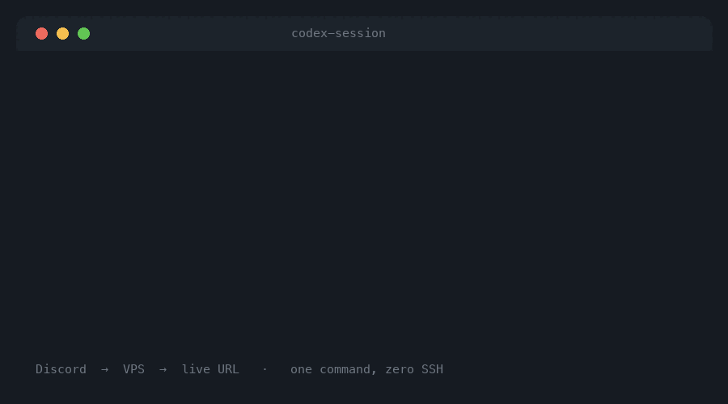
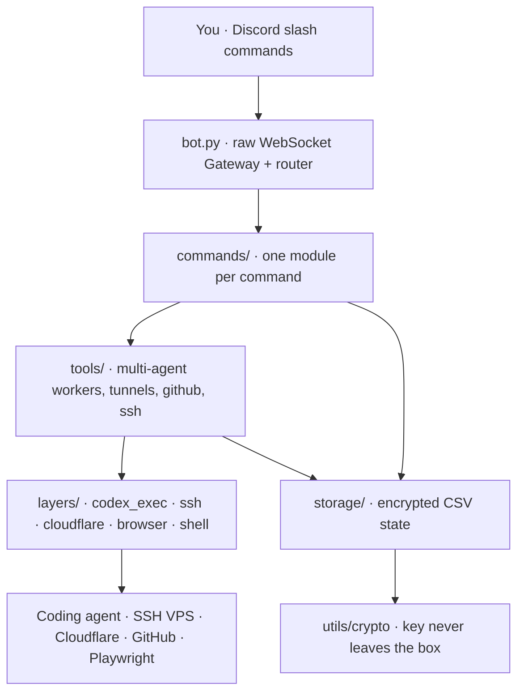

<div align="center">

# Codex Session

### Your coding agent lives on a cheap VPS. You live in Discord. This is the bridge.

[](https://www.python.org/)
[](https://discord.com/developers/docs)
[](https://playwright.dev/)
[](https://developers.cloudflare.com/cloudflare-one/connections/connect-networks/)
[](LICENSE)

<em>One VPS. One Discord server. Zero babysitting.</em>

</div>

---

**Codex Session** turns an ordinary Ubuntu box — a $5 Contabo, Linode, or Hetzner droplet — into an always-on coding workspace you drive entirely from Discord slash commands. Kick off a long-running coding session, watch it build, preview the result in your browser, push to GitHub, deploy over SSH, and expose it to the world through a Cloudflare Tunnel — all without ever SSH-ing in yourself or touching a heavyweight cloud console.

The whole runtime, storage, and integration stack is here and working today, with a Codex-native execution core growing in alongside the current agent layer.

<div align="center">



<sub><em>The <code>/make-live</code> pipeline: Codex build → browser preview → SSH deploy → Cloudflare Tunnel → live URL.</em></sub>

**Live demo:** deploying soon.

</div>

---

## Why this exists

Most "AI coding agent" setups assume you're glued to a terminal or paying for a sprawling managed platform. But a lot of us just want a small server that quietly keeps building things while we're doing something else — and a chat window to poke it from our phone. Codex Session is that: **one VPS, one Discord server, zero babysitting.** The bot stays alive across reboots via systemd, remembers your projects and sessions in encrypted local storage, and only reaches for the network when you ask it to.

No AWS. No Kubernetes. No dashboard tab you forget you left open.

---

## What you get

- 🧵 **Discord-native sessions** — start, resume, and recover coding sessions as threads; each project gets its own conversation.
- 🤖 **Multi-agent workers** — fan out a numbered spec into several project-scoped agents that build in parallel, with **file-conflict detection** so two agents never clobber the same file.
- 🖥️ **SSH deploy + port tracking** — ship a service to your VPS and keep tabs on which port is doing what.
- 🌐 **Cloudflare Tunnels & Pages** — expose a preview or go live behind a real domain, safely.
- 🐙 **GitHub automation** — connect once, then create repos, push, and share straight from chat.
- 📸 **Browser previews & visual test loops** — screenshot a running app with console output, and run an auto test-and-fix loop.
- 🔐 **Encrypted local storage** — tokens and state live in CSV-backed stores encrypted with a key that never leaves the box.
- 🚀 **`/make-live`** — one command that chains Codex → preview → deploy → tunnel → live URL.

### The slash-command deck

| Command | What it does |
|---|---|
| `/ping` | Check the bot is awake |
| `/project` | Create and manage local projects |
| `/files`, `/file` | Browse and read project files |
| `/codex` (alias `/claude`) | Talk to the coding agent |
| `/session` | Manage and recover coding sessions |
| `/preview` | Browser preview + screenshots |
| `/server` | Register and manage SSH servers |
| `/deploy` | Deploy a project to a server |
| `/cloudflare` | Manage Cloudflare resources |
| `/github` | Connect GitHub, create/push repos |
| `/test` | Visual tests + auto fix loop |
| `/discord` | Native messages, scheduling, threads |
| `/make-live` | Full release pipeline in one shot |

---

## Quick start (the two-minute version)

You'll need a **Discord bot token**, a **guild (server) ID**, and Python 3.11+. Everything else is optional and connects lazily the first time you use it.

```bash
# 1. Grab the code
git clone https://github.com/waleedsworld/codex-session.git
cd codex-session

# 2. Make a clean Python home for it
python3 -m venv .venv
. .venv/bin/activate

# 3. Install the dependencies (and the headless browser for previews)
pip install -r requirements.txt
python -m playwright install chromium

# 4. Copy the config template and fill it in
cp .env.example .env
#   → open .env and paste your DISCORD_BOT_TOKEN and DISCORD_GUILD_ID

# 5. Register the slash commands with Discord (do this once, and after any command change)
python register_commands.py

# 6. Wake it up
python bot.py
```

If you forget a required value, the bot won't leave you guessing — it runs a friendly **preflight check** on startup and tells you exactly what's missing and where to get it.

### Where do the tokens come from?

- **`DISCORD_BOT_TOKEN`** — [discord.com/developers/applications](https://discord.com/developers/applications) → your app → **Bot** → *Reset Token*.
- **`DISCORD_GUILD_ID`** — enable **Developer Mode** in Discord (Settings → Advanced), then right-click your server icon → *Copy Server ID*. Slash commands register per-guild, so they show up instantly.
- **Anthropic / Cloudflare / GitHub / SSH** — all optional; drop them into `.env` whenever you want that integration to light up.

---

## Run it on a server (the way it's meant to live)

There's a one-shot installer that provisions a fresh Ubuntu box end to end — system packages, a virtualenv, the headless browser, and a **systemd unit** so the bot restarts on crash or reboot:

```bash
bash <(curl -fsSL https://raw.githubusercontent.com/waleedsworld/codex-session/main/scripts/install.sh)
```

It creates `/opt/codex-session`, installs everything, and leaves you three steps: edit `.env`, run `register_commands.py`, and `systemctl restart codex-session`. Tail the logs with `journalctl -u codex-session -f`.

---

## A typical day with it

```
you → /project new my-api
you → /codex build a FastAPI service with a /health route and a Dockerfile
bot   … working in thread …  ✅ 6 files written
you → /preview                       # bot boots it, screenshots the browser, shows console logs
you → /github push                   # repo created, code pushed
you → /make-live                     # deploy over SSH → open a Cloudflare Tunnel → hands you a live URL
bot   🌐 https://my-api.example.workers.dev
```

Every step happens from the chat window. You never SSH in, never open a cloud console, never leave Discord.

---

## Architecture

Codex Session is layered so each concern stays swappable: slash commands sit on top, integration **layers** wrap the outside world, **tools** compose them into workflows, and everything durable lands in encrypted, CSV-backed **storage**.



### Project layout

```
bot.py                 Discord Gateway entry point + slash-command router
register_commands.py   One-shot slash-command registration
commands/              One module per slash command (project, deploy, test, github…)
layers/                Integration cores: codex_exec, ssh, cloudflare, browser, shell
tools/                 Higher-level workflows: multi-agent workers, ssh, tunnels, github
storage/               Encrypted CSV-backed state (projects, sessions, servers, agents)
utils/                 crypto, security guards, discord + threading helpers
skills/                Reusable build guides + the make-live release skill
scripts/install.sh     VPS bootstrapper (installs a systemd service)
docs/                  Codex migration technical spec
```

---

## Testing

There are two layers of tests, both offline — no live Discord, SSH host, or browser needed.

**Unit suite (pytest).** Fast, deterministic checks over the dependency-light helper modules — credential encryption, path/shell sanitization, output truncation, and the encrypted host/service store:

```bash
pip install -r requirements-dev.txt
pytest                             # runs everything under tests/
pytest tests/test_security.py -v   # just the sanitization guards
```

**Script-driven flow checks.** Mocked end-to-end exercises of the multi-agent orchestration:

```bash
python test_bulk_flow.py           # mocked end-to-end multi-agent flow
python test_bulk_cli.py parse-only # validate spec parsing without calling the agent
```

The spec parser, multi-agent file-conflict detection, and system-prompt injection all run offline; only the checks that hit Discord's API directly need a live token.

---

## Configuration reference

Everything is driven by `.env` (see `.env.example`). Keep `.env`, `.storage_key`, and anything under `data/*.csv` **out of version control** — the shipped `.gitignore` already does this for you. Security-sensitive knobs worth knowing:

| Variable | Purpose |
|---|---|
| `ALLOWED_PROJECT_ROOTS` | Whitelist of directories the bot may touch |
| `MAX_OUTPUT_CHARS` / `COMMAND_TIMEOUT` | Guardrails on runaway output and long commands |
| `ENCRYPTION_KEY` | Auto-generated on first run if left blank |

---

## Roadmap

The current execution layer is agent-centered (`layers/claude_exec.py`) while the Codex-native core (`layers/codex_exec.py`) grows in alongside it. If you want to push the Codex backend forward, start with [`docs/codex-session-technical-spec.md`](docs/codex-session-technical-spec.md) — it lays out the always-on, multi-session server design this repo is heading toward.

---

## License

Released under the [MIT License](LICENSE). Use it, fork it, ship it.

---

<div align="center">
<sub>Built with a lot of coffee and a stubborn belief that a coding agent should be as easy to talk to as a friend in a group chat.</sub>
</div>
